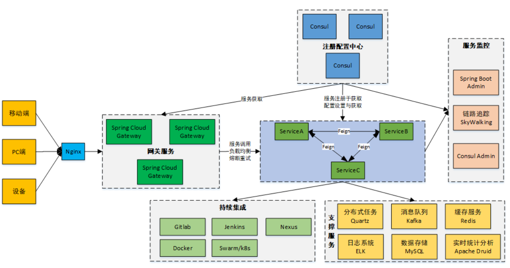

<div align="center"> 

# 🚚 品达物流-TMS  
**运输全流程管理解决方案 | 适用于运输公司与企业运输队**  


</div>


## 📌 项目简介  
**品达物流-TMS**（Transportation Management System）是一款面向运输公司的全流程管理系统，覆盖从运力资源准备到货物交付的全生命周期管理。  
系统设计目标：  
- **降本增效**：通过智能调度和资源优化降低空驶率  
- **全程可视化**：集成GPS定位与轨迹追踪实现物流透明化  
- **多端协同**：支持管理端、客户端、快递员端、司机端联动  

### 🎯 核心价值  
- **行业适配性**：支持快递、快运、专线、三方物流四大主流模式  
- **数据驱动**：通过Druid实时分析与HBase冷热数据分离实现高效决策  
- **扩展性强**：微服务架构支持快速对接第三方系统（如WMS、ERP）  

---

## 🧩 用户端口  
| 端口类型       | 功能描述                                                                 | 技术实现                  |
|----------------|--------------------------------------------------------------------------|---------------------------|
| **后台管理端** | 基础数据维护、订单管理、运单管理、权限配置                                | Vue + Spring Boot Admin   |
| **客户端App**  | [品达速运]：寄件、物流状态追踪、异常申报                                  | Weex + WebSocket实时推送  |
| **快递员App**  | [品达快递员]：接收取派件任务、扫码签收、异常上报                          | MQTT + GPS轨迹采集        |
| **司机端App**  | [品达司机宝]：接收运输指令、实时位置上报、路线导航                          | 高德SDK + Kafka消息队列   |

---

## 📐 项目架构  
### 系统架构全景  
  
**核心设计原则**：  
- **微服务化**：基于Spring Cloud Alibaba拆分为7大业务域  
- **数据分层**：OLTP（MySQL）与OLAP（Druid/Hive）分离  
- **多级缓存**：Redis热点缓存 + Caffeine本地缓存  

### 微服务架构详解  
  
**服务划分**：  
1. **pd-auth**：统一鉴权中心（JWT + OAuth2）  
2. **pd-gateway**：API网关（路由/限流/熔断）  
3. **pd-oms**：订单服务（Saga分布式事务）  
4. **pd-dispatch**：智能调度引擎（规则引擎Drools）  
5. **pd-tracking**：轨迹服务（Netty长连接 + GeoHash）  
6. **pd-report**：数据报表（ECharts可视化）  
7. **pd-config**：配置中心（Nacos动态配置）  

---

## 🧱 技术架构体系  
  
### 核心技术栈  
| 层级         | 技术选型                                                                 |
|--------------|--------------------------------------------------------------------------|
| **前端**     | Vue3 + Weex + ECharts + Vant                                            |
| **网关层**   | Spring Cloud Gateway + Sentinel                                         |
| **服务层**   | Spring Boot 2.7 + MyBatis Plus + MapStruct                              |
| **消息队列** | Kafka 3.0 + RocketMQ                                                    |
| **数据层**   | MySQL 8.0 + MongoDB 5.0 + HBase 2.4 + Druid 0.23                        |
| **中间件**   | Nacos 2.1 + Redis 6.2 + XXL-JOB                                        |
| **监控**     | Prometheus + Grafana + SkyWalking                                       |

---

## 📊 整体业务流程  
  
**核心流程解析**：  
1. **订单创建**：C端下单 → 风控校验 → 自动生成运单  
2. **智能配载**：根据货物体积/重量匹配最优车型  
3. **动态调度**：实时路况预测 → 路径规划算法（A*算法优化）  
4. **在途监控**：每10秒上报GPS坐标 → 轨迹存储（GeoHash编码）  
5. **异常处理**：温感报警/偏航预警 → 人工介入流程  

---

## 📁 模块功能详解  
### 核心业务模块  
#### 1. **订单管理（pd-oms）**  
- 支持多维度订单合并（拼单率提升35%）  
- 异常订单自动冻结（超时未支付/异常地址）  
- 对接支付系统（支付宝/微信/银联）  

#### 2. **智能调度（pd-dispatch）**  
- 实时运力计算：基于车辆GPS位置+剩余载重  
- 动态路径规划：考虑实时交通流量（高德API）  
- 优先级调度：VIP客户订单自动加急  

#### 3. **车辆管理（pd-base）**  
- 电子围栏：区域违规闯入报警  
- 维保提醒：基于行驶里程自动触发  
- OBD对接：故障码实时解析  

#### 4. **轨迹服务（pd-tracking）**  
- Netty长连接维持10万+并发连接  
- 轨迹压缩算法（Douglas-Peucker算法）  
- 偏航检测：基于预设路线的偏离度计算  

---

## 💾 数据库设计  
| 数据库名          | 数据量级     | 核心表设计                                                                 |
|-------------------|--------------|----------------------------------------------------------------------------|
| `pd_base`         | 500万+       | 车辆表（字段含VIN码/载重/容积/年检日期）                                    |
| `pd_oms`          | 1亿+         | 订单分表（按月份拆分，使用ShardingSphere）                                  |
| `pd_tracking`     | 10亿+        | 轨迹点表（GeoHash索引加速查询）                                            |
| `druid_realtime`  | 实时写入     | Kafka数据实时摄入，支持秒级延迟                                            |

---

## 🧰 Maven私仓配置  
### 依赖配置说明  
```xml
<!-- settings.xml 配置示例 -->
<profiles>
  <profile>
    <repositories>
      <repository>
        <id>gitee-repo</id>
        <url>https://gitee.com/itxinfei/pinda-tms/repository/archive</url>
      </repository>
    </repositories>
  </profile>
</profiles>
```

### 核心自定义依赖  
```xml
<!-- 权限校验模块 -->
<dependency>
  <groupId>com.itheima</groupId>
  <artifactId>pd-auth-entity</artifactId>
  <version>1.0.0</version>
</dependency>

<!-- 通用工具类 -->
<dependency>
  <groupId>com.itheima</groupId>
  <artifactId>pd-common-utils</artifactId>
  <version>1.0.0</version>
</dependency>
```

---

## 📦 关联仓库协同  
1. **品达物流-通用权限**  
   - 提供RBAC权限模型实现  
   - 支持数据权限粒度控制（如区域经理仅可见所属片区）  

2. **品达物流-集信达**  
   - 物联网设备对接平台  
   - 支持OBD/温感/货厢摄像头等硬件数据采集  

---

## 📝 注意事项  
1. **部署依赖**：  
   - 需安装JDK1.8+、Maven3.3+、Docker  
   - 中间件依赖：Nacos、Redis、Kafka  

2. **数据初始化**：  
   ```bash
   # 初始化基础数据
   mysql -u root -p pd_base < sql/init_base.sql
   ```

3. **日志排查**：  
   - 日志目录：`logs/pinda-tms/*.log`  
   - 关键指标监控：`/actuator/prometheus`  

---

## 📱 关注微信公众号  
  
🚀 项目地址：[https://gitee.com/itxinfei/pinda-tms](https://gitee.com/itxinfei/pinda-tms)  
👥 QQ交流群：[661543188](https://qm.qq.com/cgi-bin/qm/qr?k=gNgch-wCkfUu-QbI7DZSudrax2BN7vY0&jump_from=webapi&authKey=QHSRnxQvu+h5S3AXGn/DSHrVPiFQAYEk6bSlCE1lS276SFjQAUagV4FG7bHf0OSM)  
📧 邮箱支持：[747011882@qq.com](http://mail.qq.com/cgi-bin/qm_share?t=qm_mailme&email=f0hLSE9OTkdHTT8ODlEcEBI)  

